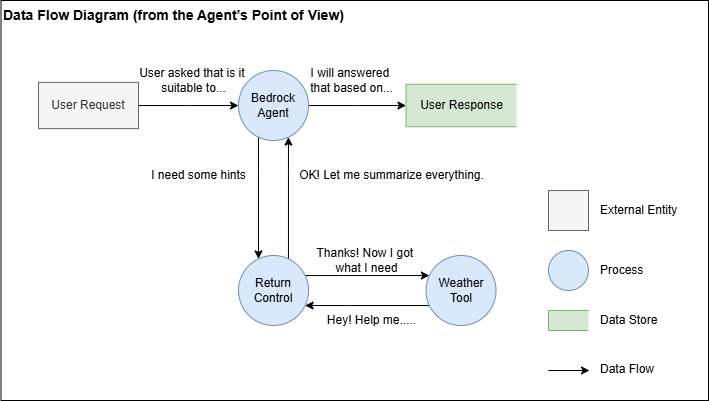
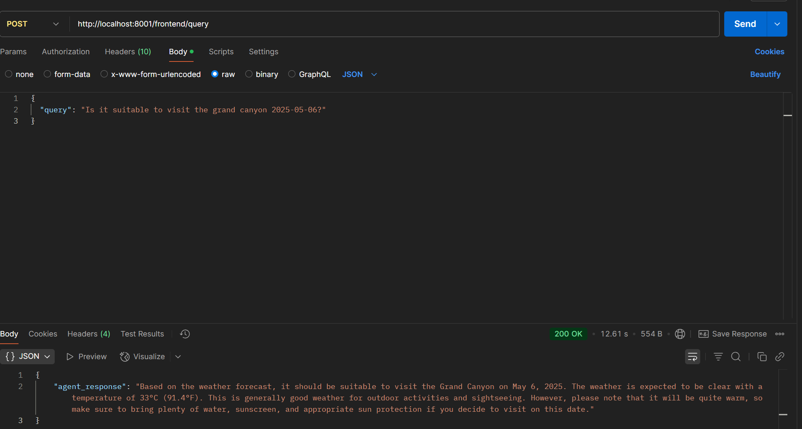

# ROC Weather - Extensible Bedrock Agent Implementation

> 📚 This project accompanies the Medium series:  
> [Part 1 – MCP: The Missing Bridge That Makes AI Agents Truly Dynamic](https://awstip.com/mcp-the-missing-bridge-that-makes-ai-agents-truly-dynamic-6399ddbe0110)  
> [Part 2 – From Concept to Code: Building Your First MCP-Powered Agent on AWS (1)](https://awstip.com/from-concept-to-code-building-your-first-mcp-powered-agent-on-aws-1f7e19a302bd)  
> [Part 3 – From Concept to Code: Building Your First MCP-Powered Agent on AWS (2)](https://medium.com/@yhocotw31016/from-concept-to-code-building-your-first-mcp-powered-agent-on-aws-2-a8a819205cb5)

This project demonstrates how to build a highly extensible Amazon Bedrock Agent architecture by simulating the core principles of the Model Context Protocol (MCP)—specifically, its "plug-and-play" philosophy. While the implementation does not follow the formal MCP specification, it mimics the spirit and modularity of MCP, enabling flexible integration with external services. The system is orchestrated by a Return Control (ROC), which coordinates communication between the Bedrock Agent and MCP-style services.

## Project Structure

The project includes two main components:

1. **mcp-weather-server**: A microservice providing weather information
2. **roc-orchestrator**: Manages communication between the Bedrock Agent and MCP-style services

```
roc_weather/
├── mcp-weather-server/       # Weather microservice
│   ├── mock_weather/         # Mock weather data providers
│   └── mcp_server.py         # FastAPI server
└── roc-orchestrator/         # ROC orchestrator
    ├── roc_handler.py        # Handles Bedrock Agent requests
    └── roc_server.py         # Communicates with the Bedrock Agent
```

## Data Flow Diagram

This diagram illustrates the flow of data from the first-person perspective of an Amazon Bedrock Agent. It shows how I, the Agent, receive a user query and delegate the task using Return Control. The orchestrator (ROC) handles the actual execution by calling an MCP-style weather microservice. Once the weather data is returned, the orchestrator formats the response and sends it back to me. I then deliver the final answer to the user.

The flow is as follows:

1. A user sends me a question, like “What’s the weather in Seattle tomorrow?”
2. I recognize that this requires tool usage, so I initiate a Return Control request.
3. The ROC receives my request and calls the appropriate MCP server.
4. The MCP weather server responds with data.
5. The ROC formats the result and returns it to me.
6. I respond to the user with the answer.



## Environment Setup

### Prerequisites

* Python 3.11+
* AWS account with necessary permissions
* Amazon Bedrock access

### Installation Steps

1. **Clone the Repository**

```bash
git clone <repository-url>
cd roc_weather
```

2. **Set Up MCP Service**

```bash
cd mcp-weather-server
py -3.11 -m venv .mcp_venv
source .mcp_venv/bin/activate  # Windows: .mcp_venv\Scripts\activate
pip install -r requirements.txt
```

3. **Set Up ROC Service**

```bash
cd ../roc-orchestrator
py -3.11 -m venv .roc_venv
source .roc_venv/bin/activate  # Windows: .roc_venv\Scripts\activate
pip install -r requirements.txt
```

4. **Configure Environment Variables**

Create a `.env` file in the `roc-orchestrator` directory:

```
BEDROCK_AGENT_ID=your_agent_id
BEDROCK_AGENT_ALIAS_ID=your_agent_alias_id
MCP_WEATHER_URL=http://localhost:8003
ROC_HANDLER_URL=http://localhost:8002
```

## Starting the Services

1. **Start MCP Service**

```bash
cd mcp-weather-server
source .mcp_venv/bin/activate  # Windows: .mcp_venv\Scripts\activate
uvicorn mcp_server:app --host 0.0.0.0 --port 8003
```

2. **Start ROC Service**

```bash
cd roc-orchestrator
source .roc_venv/bin/activate  # Windows: .roc_venv\Scripts\activate
uvicorn roc_handler:app --host 0.0.0.0 --port 8002
uvicorn roc_server:app --host 0.0.0.0 --port 8001
```

## Manually Create a Bedrock Agent

### Step 1: Create the Bedrock Agent

1. Log into AWS Console and navigate to Amazon Bedrock
2. Go to "Agents" and click "Create agent"
3. Provide an agent name and description
4. Select a foundation model (e.g., Claude or Anthropic)
5. Complete the setup and create the agent

> Ensure Foundation Model access is enabled.

### Step 2: Create an Action Group

1. On the agent detail page, go to the "Action groups" tab
2. Click "Add" to create a new Action Group
3. Name it `ag_weather_get`
4. Add the following API schema in JSON:

```json
{
  "name": "getWeather",
  "description": "Get the weather of a given location",
  "parameters": {
    "0": {
      "description": "The city or location to get weather for",
      "required": "False",
      "type": "string"
    },
    "1": {
      "description": "The date of the weather forecast",
      "required": "False",
      "type": "string"
    }
  },
  "requireConfirmation": "DISABLED"
}
```

5. Choose "Return control to agent" as the Action Type

### Step 3: Create an Agent Alias

1. In the agent details page, go to the "Aliases" tab
2. Click "Create alias"
3. Provide an alias name and description
4. Select the agent version
5. Finish creation

### Step 4: Update Environment Variables

Copy `.env.example` to `.env`:

```bash
cp roc-orchestrator/.env.example .env
```

Update Agent ID and Alias ID:

```
BEDROCK_AGENT_ID=your_agent_id
BEDROCK_AGENT_ALIAS_ID=your_agent_alias_id
```

## Testing

### Test with Mock Data

The mock data provider (`MockProvider`) includes the following predefined data:

```python
FAKE_DATABASE = {
    ("taipei", "today"): ("Sunny", "26°C"),
    ("taipei", "tomorrow"): ("Cloudy", "24°C"),
    ("平鎮區, 桃園市, 台灣", "today"): ("Rainy", "20°C"),
    ("平鎮區, 桃園市, 台灣", "tomorrow"): ("Sunny", "22°C"),
    ("grand canyon, usa", "today"): ("Hot", "35°C"),
    ("grand canyon, usa", "2025-05-06"): ("Clear", "33°C"),
}
```

You can test the system using these default entries.

### Test via Postman or HTTP Client

1. Send a POST request to `http://localhost:8001/frontend/query`
2. Use the following JSON as request body:

```json
{
  "query": "Is it suitable to visit the grand canyon 2025-05-06?"
}
```

3. You should receive a response containing the weather information.



## Weather Scraper Extension

### Add a New Weather Provider

1. Create a new provider class in the `mock_weather` directory
2. Inherit from the `WeatherProvider` base class and implement the `fetch` method
3. Register the new provider in `registry.py`:

```python
from .your_provider import YourProvider
register_provider("your_provider", YourProvider)
```

4. Use the new provider:

```python
get_weather(city="taipei", date="today", source="your_provider")
```

## Troubleshooting

* **Connection issues**: Ensure all services are running on correct ports (8001, 8002, 8003)
* **Authentication issues**: Verify AWS credentials and Bedrock permissions (this demo assumes CLI access)
* **Missing data**: Check if the city and date combination exists in the mock database

## References

* [Amazon Bedrock Documentation](https://docs.aws.amazon.com/bedrock/)
* [FastAPI Documentation](https://fastapi.tiangolo.com/)
* [AWS SDK for Python (Boto3)](https://boto3.amazonaws.com/v1/documentation/api/latest/index.html)